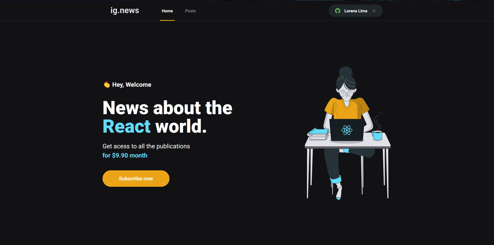

<h1 align="center">Ignite: Desafio 09 - Deploy do Ignews</h1>

## :bookmark_tabs: Desafio
Fazer o deploy da aplicação Ignews desenvolvida no Chapter III. 

## :sparkler: Aplicação

## 🚀 Tecnologias

- [Next.js](https://nextjs.org/)
- [Prismic CMS](https://prismic.io/)
- [Stripe](https://stripe.com/)
- [FaunaDB](https://fauna.com/)
- [Sass](https://sass-lang.com/)
- [Jest](https://jestjs.io/)

LINK: https://ignews-loressl.vercel.app/
